# Application de Gestion de Réservations Immobilières

Projet Laravel avec Breeze (auth), Livewire, Filament et TailwindCSS.

## Prérequis

- PHP 8.1+
- Composer
- MySQL (ou SQLite pour développement)
- Node.js & NPM
- Git

## Installation

### 1. Cloner et dépendances

```bash
cd laravel-test
composer install
cp .env.example .env
php artisan key:generate
```

### 2. Base de données

**Option A – SQLite (défaut)**  
Créez le fichier de base :

```bash
touch database/database.sqlite
```

**Option B – MySQL**  
Dans `.env` :

```env
DB_CONNECTION=mysql
DB_HOST=127.0.0.1
DB_PORT=3306
DB_DATABASE=laravel
DB_USERNAME=root
DB_PASSWORD=
```

Puis :

```bash
php artisan migrate
php artisan db:seed
```

### 3. Filament (panneau admin)

```bash
composer require filament/filament
php artisan filament:install --panels
```

Créer un utilisateur admin :

```bash
php artisan make:filament-user
```

Seuls les utilisateurs **administrateurs** ont accès à `/admin`. Après la migration, donnez ce droit au compte créé :

```bash
php artisan migrate
php artisan user:make-admin user@test.gmail
```

(Remplacez par l’email du compte.) Dans l’admin : **Administration > Utilisateurs** pour gérer les comptes et créer des admins.

Voir **DOCUMENTATION.md** pour la documentation complète.

### 4. Assets frontend

```bash
npm install
npm run dev
```

### 5. Lancer l’application

```bash
php artisan serve
```

- **Site** : http://localhost:8000  
- **Admin Filament** : http://localhost:8000/admin  

## Comptes de test

- **Utilisateur** : créé par `php artisan db:seed` (voir `DatabaseSeeder` : test@example.com).
- **Admin** : créé avec `php artisan make:filament-user`.

## Structure du projet

- **Authentification** : Laravel Breeze (Blade)
- **Propriétés** : liste publique, détail avec formulaire de réservation Livewire
- **Réservations** : composant Livewire `BookingManager` (dates, calcul du total, validation des chevauchements)
- **Admin** : Filament pour CRUD Propriétés et Réservations
- **Styles** : TailwindCSS (couleurs `primary` #1E40AF, `secondary` #9333EA)


## Captures d’écran

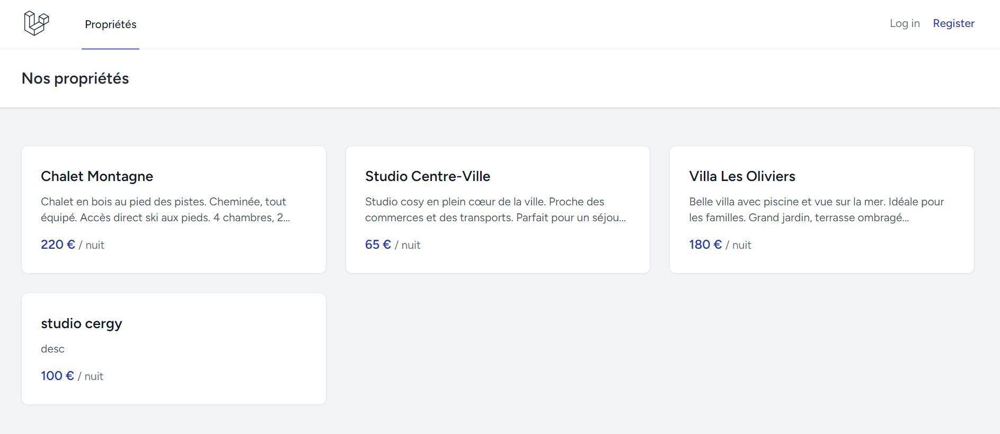
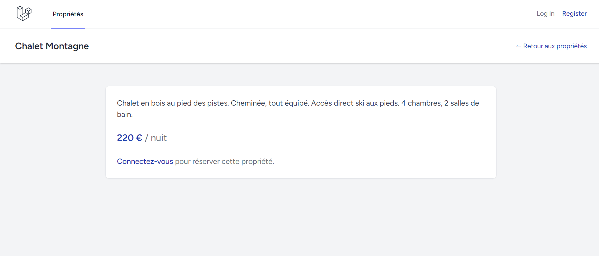
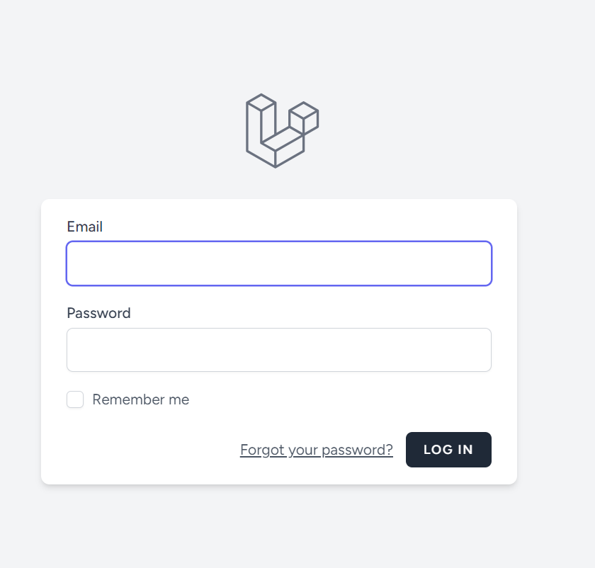
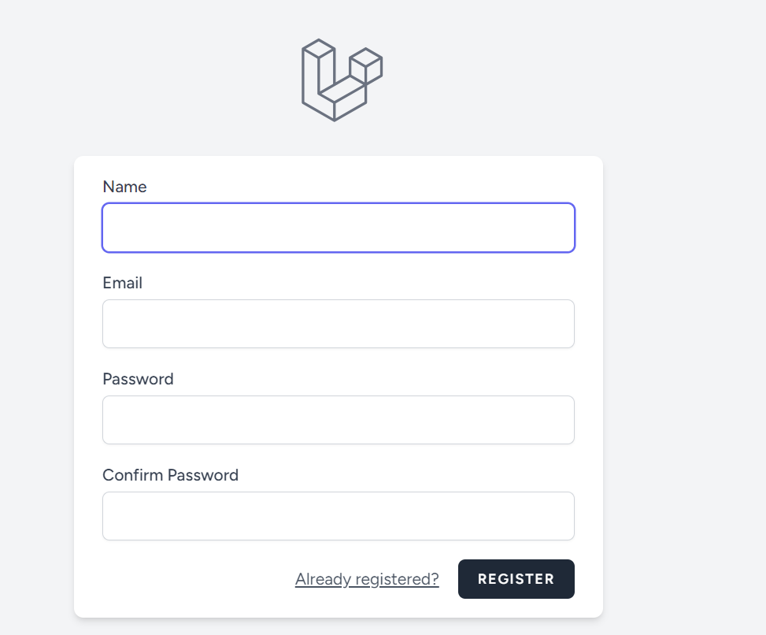
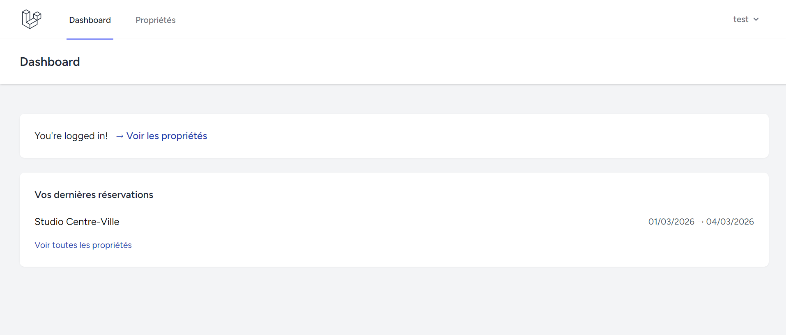
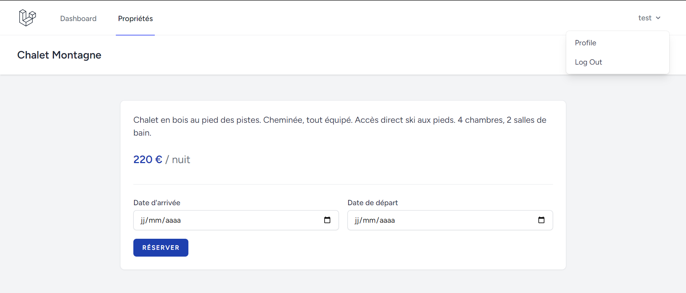
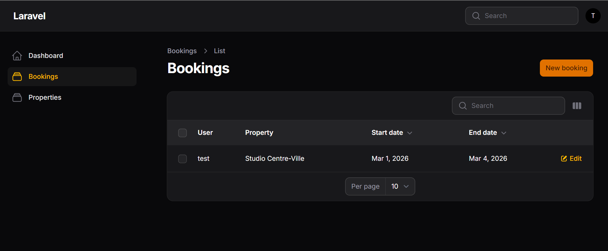
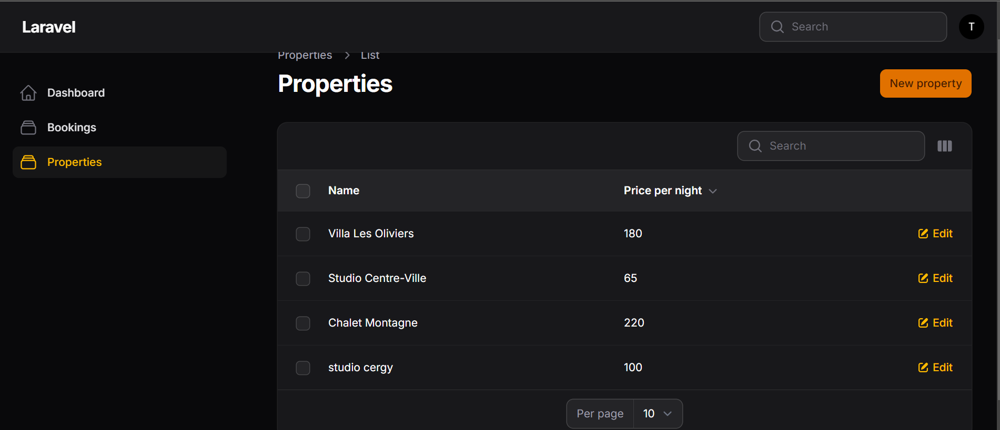

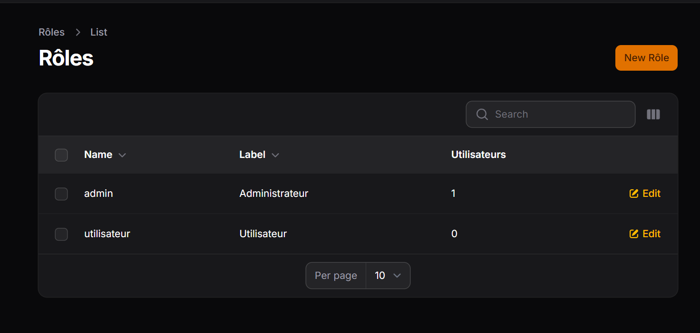
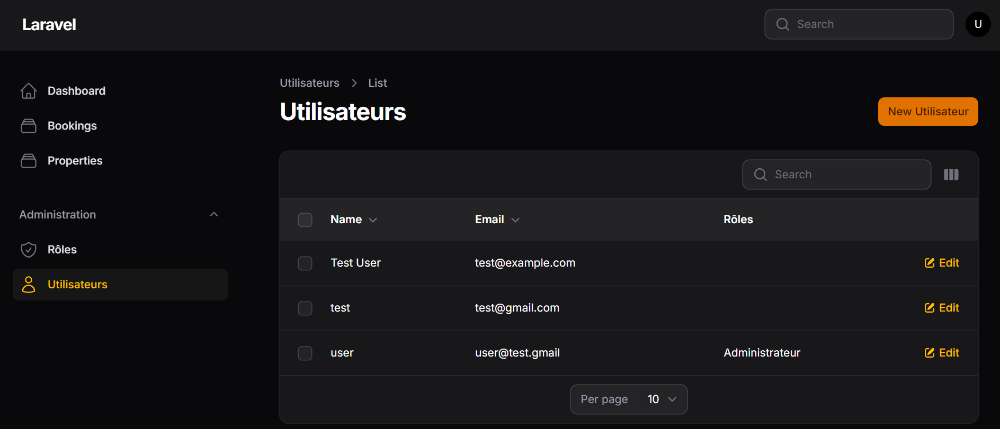
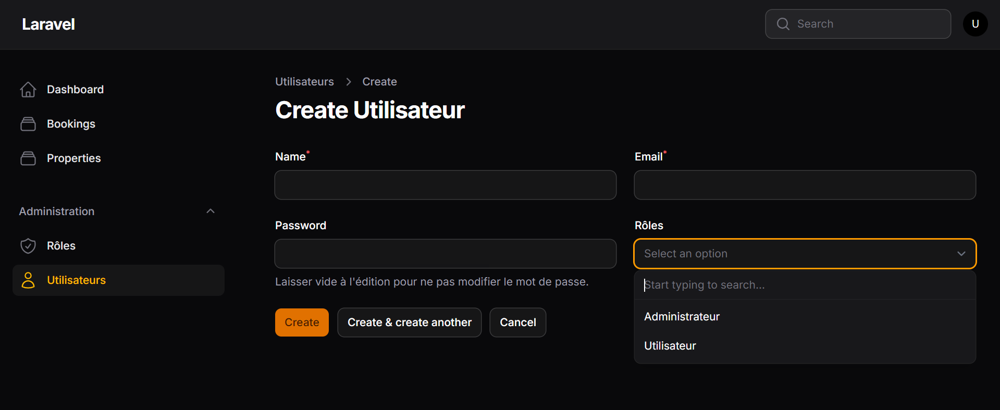